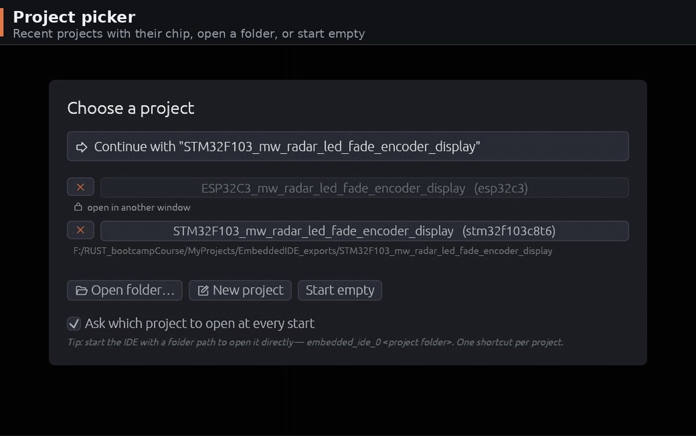

# Embedded IDE

A desktop IDE for **bare-metal Rust** firmware. Pick a microcontroller, configure
its pins, peripherals and clock tree visually, and the IDE writes a complete,
buildable Cargo project for you — then edit, check, flash, debug and profile it
without ever leaving the app.

It is built for the workflow of small MCU projects: you spend your time deciding
*what each pin does* and *how fast the chip runs*, and the IDE turns those
decisions into correct HAL setup code. Your own application logic is always kept
safe across regenerations.



> Status: early development (`v0.1`). **Fourteen chips ship built in** — one
> STM32, nine ESP32 and all four Raspberry Pi Pico boards — and the rest of the
> STM32 catalogue is reachable by importing a part from ST's own database. A new
> chip inside a supported family is plain data, no rebuild.

---

## What you can do

- **Configure a chip visually** — assign pin functions on a chip diagram, or work
  peripheral-by-peripheral.
- **Drop in ready-made peripheral devices** — add a USART / SPI / I²C / CAN / PWM
  / camera / touch device and the IDE auto-wires the pins and generates its init
  code.
- **Design the clock tree interactively** — adjust sources, multiplexers,
  multipliers and dividers and watch every frequency (and every over-limit
  warning) update live.
- **Choose a runtime** — Blocking, Native, RTIC or async (embassy / esp-rtos),
  including **preemptive task priorities** on ESP32.
- **Get generated firmware** — a full `src/main.rs` plus the whole Cargo project,
  with your code preserved.
- **Edit with a real code editor** — rust-analyzer completion and diagnostics,
  go-to-definition, rename, refactors, multi-cursor, folding and formatting.
- **See the code as a picture** — a module-relationship map (Structure) and a
  per-function flowchart (Flow).
- **Build, flash, debug and measure** — `cargo check`/`build`, one-click flashing
  over SWD / probe-rs / DFU / espflash, an on-target debugger, RTT/defmt logs, a
  serial console with plotting, and Flash/RAM size bars.
- **Save & reopen projects** — round-trips the chip, every pin, the clock config,
  and your edits.

---

## Supported microcontrollers

Support comes in two layers, and it is worth knowing which one you are on:

- **Built in** — the chip ships inside the binary. Pick it and go.
- **Importable** — the chip comes from ST's own database (or a `.ron` you write).
  A part in a family that already has a code backend needs **no rebuild**.

### STM32

`STM32F103C8T6` is the only STM32 built in. Every other part arrives through
**chip search** at *New Project*: type a part number and the IDE pulls its pin
map — and, from the STM32Cube database, its clock tree — in one click.

| Family | HAL | Clock tree | Representative parts |
|--------|-----|-----------|----------------------|
| **STM32F1** | `stm32f1xx-hal` (own backend) | hand-drawn | STM32F103C8T6 · STM32F103RB · STM32F105 · STM32F107 |
| **STM32C0 / F0** | `embassy-stm32` | from CubeMX | STM32C011F4 · STM32C071C8 · STM32F030R8 |
| **STM32F2** | `embassy-stm32` | hand-drawn | STM32F217ZE |
| **STM32F3** | `embassy-stm32` | from CubeMX | STM32F303RE · STM32F358CC |
| **STM32F4** | `embassy-stm32` | hand-drawn | STM32F411RE · STM32F410T8 · STM32F407 |
| **STM32F7** | `embassy-stm32` | hand-drawn (F4's) | STM32F767ZI |
| **STM32G0** | `embassy-stm32` | hand-drawn | STM32G071CB · STM32G0B1RE · STM32G031K8 |
| **STM32G4** | `embassy-stm32` | hand-drawn | STM32G431CB · STM32G474 |
| **STM32H5** | `embassy-stm32` | from CubeMX | STM32H503RB · STM32H563ZI |
| **STM32H7** | `embassy-stm32` | from CubeMX | STM32H743ZI · STM32H7A3ZI |
| **STM32L0 / L1 / L4 / L5** | `embassy-stm32` | L4 hand-drawn, rest CubeMX | STM32L4P5CE · STM32L552ZE |
| **STM32U0 / U3 / U5** | `embassy-stm32` | from CubeMX | STM32U575ZI |
| **STM32WB / WB0 / WBA** | `embassy-stm32` | WBA hand-drawn | STM32WBA55CG |
| **STM32WL** | `embassy-stm32` | from CubeMX | STM32WL55 (see the note below) |
| **STM32N6** | `embassy-stm32` | own emitter | STM32N657X0 · STM32N645A0 |

Eight families have a **hand-drawn, fully interactive clock tree** (F1, F2, F4,
F7, G0, G4, L4, WBA — F4 and F7 share one). The rest read theirs from the
STM32Cube database, and the IDE knows every family's **peripheral clock
selectors** — over 150 part-prefix rules spanning C0 through WL.

With a CubeMX install detected, that is roughly **2,800 orderable parts**. The
STM32_open_pin_data checkout reaches a few hundred more (including STM32WL4,
which CubeMX lacks), but carries no clock trees — those parts start from the
chip's reset defaults.

> Not every part in a supported family is a working target. `STM32WL30` is the
> worked example: no clock code and no `embassy-stm32` feature. The IDE says so
> up front rather than generating a project that cannot build — and a matrix case
> pins that verdict so it fails the day the answer changes.

### ESP32

All nine ship built in, generated from `esp-metadata` and driven by `esp-hal`.

| Chip | Core | Max clock | SRAM | Target |
|------|------|-----------|------|--------|
| **ESP32-C2** | RISC-V 32-bit | 120 MHz | 256 KB | `riscv32imc-unknown-none-elf` |
| **ESP32-C3** | RISC-V 32-bit | 160 MHz | 384 KB | `riscv32imc-unknown-none-elf` |
| **ESP32-C5** | RISC-V 32-bit | 240 MHz | 384 KB | `riscv32imac-unknown-none-elf` |
| **ESP32-C6** | RISC-V 32-bit | 160 MHz | 512 KB | `riscv32imac-unknown-none-elf` |
| **ESP32-C61** | RISC-V 32-bit | 160 MHz | 320 KB | `riscv32imac-unknown-none-elf` |
| **ESP32-H2** | RISC-V 32-bit | 96 MHz | 320 KB | `riscv32imac-unknown-none-elf` |
| **ESP32** | Xtensa LX | 240 MHz | 328 KB | `xtensa-esp32-none-elf` |
| **ESP32-S2** | Xtensa LX | 240 MHz | 320 KB | `xtensa-esp32s2-none-elf` |
| **ESP32-S3** | Xtensa LX | 240 MHz | 480 KB | `xtensa-esp32s3-none-elf` |

The six RISC-V parts build on stable Rust with a `rustup target add`. The three
**Xtensa** parts (ESP32, S2, S3) need the `esp` toolchain from
[espup](https://github.com/esp-rs/espup): stock rustc ships the Xtensa target
definition, but its LLVM data layout differs, so even nightly `-Z build-std`
fails inside `core`. An Xtensa project is generated with a `rust-toolchain.toml`
pinning `channel = "esp"`, so every cargo the IDE launches picks it up — and the
*Required Tools* tab checks for it by name instead of blaming the next tool in
the chain.

Beyond the usual buses, ESP codegen covers **TWAI (CAN)**, **LEDC PWM**,
**MCPWM**, **PCNT**, **RMT**, **I²S**, **DAC**, **PARL_IO** (both halves at
once), **LCD_CAM** (S3), **capacitive touch** (ESP32), **USB Serial/JTAG** and
**USB OTG** (S2/S3), **SPI slave**, **GDMA** and the **RWDT / MWDT** watchdogs —
each gated on whether that chip really has the driver.

**Preemptive task priorities.** An armed input can be raised to *High* or
*Critical* from that pin's IRQ menu. The generated project then starts an
`esp_rtos::embassy::InterruptExecutor` per tier at a real hardware interrupt
priority, so a raised task **preempts** the shared one. Tasks left at the same
level stay cooperative — which is the distinction the selector spells out, since
it is the one people expect async to give them and it does not.

### Raspberry Pi Pico

All four boards ship built in. These are **boards, not chips**: the pin map is
the 40-pin header, and the on-board hardware is part of the definition.

| Board | Chip | Core | Max clock | Target |
|-------|------|------|-----------|--------|
| **Raspberry Pi Pico** | RP2040 | Cortex-M0+ ×2 | 133 MHz | `thumbv6m-none-eabi` |
| **Raspberry Pi Pico W** | RP2040 | Cortex-M0+ ×2 | 133 MHz | `thumbv6m-none-eabi` |
| **Raspberry Pi Pico 2** | RP2350 | Cortex-M33 ×2 | 150 MHz | `thumbv8m.main-none-eabihf` |
| **Raspberry Pi Pico 2 W** | RP2350 | Cortex-M33 ×2 | 150 MHz | `thumbv8m.main-none-eabihf` |

Blocking builds on `rp2040-hal` / `rp235x-hal`; async on `embassy-rp`.

> **The W boards' LED is not on the chip.** It hangs off GPIO 0 of the CYW43
> radio, reached through PIO — so it is **async only**, and it needs three
> Infineon firmware blobs, which ship in `assets/cyw43-firmware/` under their own
> license. The IDE wires all of that for you; it is called out here because
> "blink the LED" is otherwise the one thing that behaves differently on a W.

On RP the **PWM channel is welded to the pad** — slice `(n / 2) % 8`, channel A
on even pads and B on odd — so unlike ESP there is nothing to choose. The IDE
shows you the one channel that pad can be.

---

## Visual MCU configuration

### Pins tab
A vector diagram of the chip with all of its pins. Click a pin to choose what it
does from the functions that pin actually supports. Once an exclusive signal is
taken (say `USART1_TX`), it disappears from the other pins so it can never be
assigned twice.

Pin functions span **GPIO** (input / output / analog, each with its own
pull/drive mode), **ADC channels**, **timer PWM** (including complementary and
break inputs), **USART / LPUART** (TX, RX, CTS, RTS, CK), **SPI** (NSS, SCK,
MISO, MOSI, RDY), **I²C**, **I²S**, **CAN**, **USB**, **SDMMC**, **SAI**,
**DAC**, the external-memory ports (**QSPI / OCTOSPI / XSPI / HSPI**), the ESP
matrix peripherals (**PARL_IO**, **LCD_CAM**, **camera**, **touch**, **MCPWM**,
**PCNT**, **RMT**) and **debug / clock output** (SWDIO, SWCLK, MCO).

Each pin can also be given a **custom label** (e.g. `led`, `uart_dbg`) with an
input/output direction. The label flows into the generated variable name
(`pc13_out_led`), so your code reads the way you think about the board. Pins can
be collected into **device groups**, and the canvas can be rotated (2-sided 90°,
4-sided 45° diamond) without changing anything but the view.

### Peripherals tab
The same configuration seen the other way around: every peripheral the chip
exposes, listing the pins that can serve each signal, with each one's wiring
**complexity derived from its mandatory signals** rather than guessed. Where a
single pin can be routed to several signals of one peripheral (for example an
ESP32 GPIO that the matrix can route to SPI SCK/MOSI/MISO/NSS), the pin shows up
**once** with a dropdown instead of repeating — so the view stays compact.

### Configuration tab
The peripherals that have no pin to click: **IWDG / WWDG** and the ESP
watchdogs, configured as *durations* rather than as register fields, plus the
**comparators (COMP)** on G4 / U5 / WBA and a live **DMA usage list** showing
which channels are taken and by whom — fed from the codegen itself, so it cannot
drift from what is emitted.

### Virtual device modules
Instead of wiring a peripheral pin by pin, you can drop a **device** onto the
canvas and let the IDE do the wiring. Twenty-four kinds ship today:

| Group | Modules |
|-------|---------|
| **Serial buses** | USART · LPUART · SPI · I²C · CAN/TWAI |
| **External memory** | QSPI · OCTOSPI · XSPI · HSPI · SDMMC |
| **Audio / analog** | I²S · SAI · DAC |
| **Timing** | PWM/Timer · MCPWM · PCNT · RMT |
| **Video / parallel** | LCD_CAM · Camera · PARL_IO (TX) · PARL_IO (RX) |
| **Other** | USB · Touch · Custom |

Adding a device claims a free peripheral instance and its pins, draws orthogonal
connections, and generates the matching init code. The wiring is **scored, not
first-fit**: every candidate assignment is ranked, including pins you placed by
hand. Each module can be renamed, and the name carries through to the generated
variables.

Modules also carry their own settings — baud rate, parity and stop bits; SPI role
(master or slave) and transmit-only mode; I²C address; USART direction, hardware
flow control, single-wire half-duplex and swap/invert; manual **DMA channel**
selection from the channels that are actually valid for that chip. Each panel
offers only what the family's backend can really build.

---

## Clock configuration

The **Clock tab** is a live, interactive clock-tree diagram — not a form. The
oscillators, multiplexers (shown as trapezoid selectors with radio buttons),
multipliers and dividers are all editable, and the tree is re-evaluated as you
change it:

- **Live frequencies** — every node shows its current frequency, recomputed
  instantly from the sources down to SYSCLK and the peripheral buses.
- **Over-limit warnings** — if a setting pushes a node past the chip's allowed
  maximum, it is flagged right on the diagram.
- **Real codegen** — the clock you draw drives the actual setup chain in the
  generated firmware (`rcc.cfgr…freeze()` on STM32F1, an embassy `rcc` config on
  the other STM32s, `CpuClock` on ESP32), so what you see is what the chip runs.
- **Peripheral clock selectors** — the per-peripheral kernel clock choices are
  resolved per chip and emitted alongside the tree.
- **Per-chip clock trees** — eight STM32 families and the ESP32-C3 ship a
  hand-drawn graph; every other part's tree is read from the STM32Cube database
  at import. The tree, its limits and its on-screen layout are all data, so a new
  chip brings its own clock tree with it.

The tree is **persisted per project** on every family, and the whole canvas
zooms and pans like the Pins one.

---

## Code generation

- The IDE generates **`src/main.rs`** from your pin + clock configuration using
  the chip's HAL.
- Generated code sits inside a `// <<< GENERATED >>> … // <<< GENERATED END >>>`
  block. **Everything you write outside the markers** — your `loop {}` body,
  helper functions, extra `use`s — **is preserved** every time the configuration
  changes and the block is refreshed.
- Peripheral init lives in its own files under `src/pins/configs/` (one per
  USART / SPI / I²C / PWM instance), each ending with a commented read/write
  example that matches that file's handle type.
- The **entire Cargo project** is produced and kept in sync: `Cargo.toml`,
  `.cargo/config.toml`, `memory.x`, `build.rs`, `.gitignore`, `src/main.rs`, and
  any source files you add.
- **All config files are editable.** Their chip-derived parts live in a
  `GENERATED` block (using each file's own comment style — `//`, `#`, `/* */`),
  and anything you add outside is kept when the block is regenerated.
- **IDE-added dependencies are marked** with a `# <embedded-ide>` comment. Only
  marked lines are ever removed — never one your code depends on.
- **Names in the generated block never move.** A binding is suffixed with the
  *pad*, not with a peripheral index that shifts when you rewire, because your
  code under the markers refers to those names.

### System tab: runtimes

| Runtime | Where it works | What you get |
|---------|----------------|--------------|
| **Blocking** | everywhere | Plain synchronous HAL calls. On every STM32 but F1 this is still `embassy-stm32` used as a sync HAL. |
| **Native** | STM32F1 | `stm32f1xx-hal`'s own driver traits instead of the portable `embedded-io` / `embedded-hal` seam. |
| **RTIC** | STM32F1 | `#[rtic::app]`, with each armed input becoming a `#[task(binds = EXTIn)]`. |
| **Async** | every STM32 *except* F1, all ESP32, all Pico | `embassy-executor` tasks; on ESP via `esp-rtos`, on RP via `embassy-rp`. |

Where a runtime is greyed out, the tab **says why** rather than just refusing.

### Checking that the generated code builds

Unit tests can tell you the generator produced the *text* you expected. Only a
compiler can tell you that text is a program. `scripts/verify-codegen.ps1` emits
a matrix of configurations and cross-compiles each one:

```powershell
pwsh scripts/verify-codegen.ps1          # representative subset (27 cases)
pwsh scripts/verify-codegen.ps1 -Full    # every case (33)
```

Each case prints its own time, and the run ends with a total and the three most
expensive — which is how you find out that one case, `embassy`, was a third of
the bill before it was trimmed.

Warnings count as failures. Not by a switch — each case declares how many it is
allowed (`w`, default none), and any other number fails, **in either direction**.
Generated code is meant to be warning-free; the few that are deliberate (a
half-wired bus leaves its pad bound and unused, which is the compiler naming the
same pad the generated comment names) are written down as numbers instead of
being waved through.

To run it before every push:

```bash
git config core.hooksPath scripts/hooks
```

The hook only fires when something under `src/panels/mcu_module/` changed, so a
README edit costs nothing; `git push --no-verify` skips it outright.

It covers every runtime, all three vendors' HALs, and each half-wired shape — a
bus with one pad missing, a SPI without MISO, a USB with one data pin. Those last
ones are the paths that break without anyone noticing: the peripheral you
configured simply does not appear in `main.rs`, or appears naming a binding that
was never declared.

**Where it builds.** A full run leaves about 16 GB behind. Point it at a roomier
volume with `-WorkDir`, `$env:EIDE_MATRIX_DIR`, or a `scripts/matrix-dir.txt`
holding one path; `-Clean` forces a cold run. Stale directories are pruned after
a full green run.

**One run at a time, machine-wide.** Every case writes to a fixed directory, so
two runs share one `target/` and tear each other's artifacts apart — and the
damage does not look like concurrency. It surfaces as `could not write output`,
`failed to write fingerprint`, `link.exe: 1104`: errors that read as a codegen
regression and point at the wrong file. The script therefore takes a lock and
*waits* rather than refusing, because a pre-push hook that exits non-zero aborts
the push. The give-away that a failure is concurrency and not codegen is the
**timing**: a case that reports seven errors in six seconds never compiled
anything.

Two kinds of case exist. Most emit a project and cross-compile it. A **verdict**
case (`v`) runs a host test and stops there, for a chip that *cannot* be
compiled. A case whose harness writes several projects may cross-compile only
some of them in quick mode (`only`), with all of them built by `-Full`; a name in
that list matching nothing fails the case outright rather than quietly shrinking
it.

Adding a case is one row in the script's `$ALL_CASES` table. The emit harnesses
are `#[ignore]`d tests (`cargo test <name> -- --ignored`) that print
`wrote <path>` and `target: <triple>`; the script reads those lines rather than
keeping its own copy of where anything lands.

Two cases build from a real part in the STM32Cube database. Point `EIDE_CUBE_DB`
at your copy, or let them be skipped — a machine without the database reports
them as skipped rather than failed.

---

## Code editor

A syntax-highlighted editor with a project tree (generated files plus your own
modules under `src/`) and a **rust-analyzer** backend.

- **Completion** as you type after `.` and `::`, or on demand with `Ctrl+Space`.
- **Diagnostics** — errors and `cargo check` results in the bottom panel with
  click-to-jump, plus inline messages in the code and an error list in the
  top-right corner of the editor.
- **Go to definition** opens the target in a dedicated **Definition** tab, with
  the whole item coloured and a band on every occurrence of the identifier.
- **Code actions** (`Ctrl+Enter`) — rust-analyzer's assists and quick-fixes,
  including an "Add dependency" action on a `use` whose crate is missing.
- **Rename**, **extract function**, **multi-cursor**, **code folding**, and a
  formatter that also normalises spacing.
- **Unused imports and generic parameters fade** in place.
- **Two editors, one body** — the *Reference* tab opens a second file read-only
  beside the first, running the same editor.
- Re-checks run on a short idle debounce (and on save), so typing stays smooth.

### Cargo.toml dependency completion
Inside `Cargo.toml`, `Ctrl+Space` helps you add dependencies:

1. It suggests a **curated list of embedded-relevant crates** (HALs, PACs,
   `embedded-hal`, `embassy-*`, `defmt`, `heapless`, drivers, and more).
2. After you pick a crate, it fetches that crate's **available versions live from
   crates.io** and lets you choose one.
3. Inside `features = [ … ]` it suggests that crate's actual features.

### Right-click menu
Right-clicking in the editor opens a context menu listing **every command below
with its shortcut**, so you don't have to memorise them.

---

## Seeing the code as a picture

Two tabs sit next to the chip configurator and read your own source rather than
the chip's data.

- **Structure** — a module-relationship map of the project: one node per file,
  edges for the calls between them. **Double-click a file node** and it expands
  into its own call flow, with the symbols reordered into *call order* — roots
  first, then depth-first through their callees — so opening every node lays the
  project out as one puzzle map instead of an alphabetical list.
- **Flow** — the open file's functions as a flowchart: steps, branches, loops and
  `await` points, parsed with `syn`. Every box carries the source line it came
  from, so clicking one jumps there.

---

## Keyboard shortcuts

### Language intelligence

| Shortcut | Action |
|----------|--------|
| `Ctrl+Space` | Completion — code suggestions, or in **Cargo.toml** crate names, versions and features |
| `Ctrl+Enter` | rust-analyzer code actions (assists / quick-fixes) at the cursor |
| `F12` | Go to definition — opens the **Definition** tab |
| `Ctrl+F12` | Go to *implementation* (the `impl … for …` site, where `F12` on a trait method lands on the declaration) |
| `Ctrl+R` | Rename the symbol project-wide |
| `Ctrl+Alt+M` | Extract the selected lines into a new function |

### Lines and selection

| Shortcut | Action |
|----------|--------|
| `Ctrl+/` | Toggle line comment (`//` for Rust, `#` for TOML) |
| `Ctrl+Shift+/` | Wrap the selected lines in one `/* … */` |
| `Ctrl+↑` / `Ctrl+↓` | Move the selected line(s) up / down |
| `Ctrl+D` | Duplicate the line(s) at the cursor / selection |
| `Ctrl+Shift+X` | Cut the whole line(s) — plain `Ctrl+X` still cuts the selection |
| `Ctrl+←` / `Ctrl+→` | Word movement (add `Shift` to select) |
| `Ctrl+Shift+↑` / `Ctrl+Shift+↓` | Add / remove a cursor (multi-cursor) |
| `Ctrl+[` / `Ctrl+]` | Select the innermost `{ … }` block around the caret and copy it |
| `Ctrl+Shift+Q` | Fold / unfold the whole file |
| `Shift+Alt+F` | Format / re-indent the file |
| `Ctrl+C` | Copy — over an inline error, copies the message **with its code** (e.g. `… [E0599]`) |
| `Esc` | Drop the extra carets, close a popup, or restore focus to the editor |

### Search and navigation

| Shortcut | Action |
|----------|--------|
| `Ctrl+F` / `Ctrl+H` | Find / replace in the current file |
| `Ctrl+Shift+F` / `Ctrl+Shift+H` | Find / replace across the project |
| `F3` / `Shift+F3` | Next / previous match |
| `F8` / `Shift+F8` | Next / previous error |
| `Ctrl+Tab` / `Ctrl+Shift+Tab` | Most-recently-used file switching (hold `Ctrl` to walk, release to commit) |
| `Ctrl++` / `Ctrl+-` / `Ctrl+0` | Zoom the editor text in / out / reset |

### Debugger

Active while a debug session is attached, from anywhere in the app.

| Shortcut | Action |
|----------|--------|
| `F5` | Continue |
| `Shift+F5` | Stop the session |
| `F10` | Step over |
| `F11` | Step into |
| `Shift+F11` | Step out |

### Diagram canvases — Pins, Clock, Structure, Flow

| Shortcut | Action |
|----------|--------|
| Mouse wheel | Zoom at the cursor |
| `Ctrl++` / `Ctrl+-` / `Ctrl+0` | Zoom in / out / reset to fit |
| Drag | Pan |
| `Ctrl+Z` | **Pins only** — undo the last module add/remove (when no text field has focus) |
| Double-click | **Structure only** — expand a file node into its own call flow |
| Click a pin or module box | Jump to its `let` binding in the editor, with a pulsing band |

### Application

| Shortcut | Action |
|----------|--------|
| `Ctrl+S` | Save the project |
| `Enter` | Confirm a dialog, or commit a rename in the project tree |
| `Esc` | Cancel a dialog, close the find bar, or dismiss an overlay |
| `↑` / `↓` | **Terminal tab** — walk the command history |

---

## Build, flash, debug and measure

The bottom panel carries twelve tabs.

- **rust-analyzer** / **Cargo** — diagnostics and build output, parsed and
  click-to-jump. A failure with a known environment cause (a missing toolchain, a
  gutted MSVC install) is explained on a card instead of dumped raw.
- **Flash / DFU** — program the board from the toolbar:
  - **STM32** — SWD via **OpenOCD**, or `cargo run` via **probe-rs** (already
    wired into the generated `.cargo/config.toml`). USB-DFU programmers are
    detected too.
  - **ESP32** — via **espflash**, with an **ESP Monitor** in the right-hand half
    that auto-starts after a flash.
  - **Pico** — UF2 or probe-rs.
  - One shared **probe selector** across Flash, RTT, Debug and Profile.
- **RTT / defmt** — live logs streamed through the debug probe.
- **Debug** — an on-target debugger over `probe-rs dap-server`: gutter
  breakpoints, stepping, call stack and locals.
- **Serial** — a UART console with a **live plotter**, a **frames** view (one row
  per protocol frame, bad frames in red), a **matrix** view for fixed-layout
  binary payloads, and a **Bridge (MITM)** mode that relays a virtual serial pair
  so you can watch traffic a vendor tool is holding.
- **Clippy** — `cargo clippy` on demand, with an opt-in strict-lint profile;
  generated code is auto-exempted.
- **Profile** — `cargo bloat` for `.text`/Flash size per function, plus a
  **Runtime** mode that halt-samples the call stack through the probe and folds
  the samples into a **flamegraph**.
- **Terminal** — a streaming host shell (PowerShell on Windows, `$SHELL`
  elsewhere).
- **Git** — status, commit, push and pull in the project directory. Commits are
  strictly what is on disk; the tab warns in amber when the editors differ from
  the saved files, but never saves on its own.
- **Activity** — a per-action timing breakdown of Save / Build / Flash / Clippy.
- **Required Tools** — checks whether the external tools each workflow needs are
  installed, so you find out before you flash, not during. On Linux it also
  generates a `69-embedded-ide.rules` udev file for probe and serial access; the
  IDE never writes to `/etc` itself.

A **Size** button on the toolbar (and on the Flash tab, automatically after a
flash) builds `--release` and parses the ELF itself into Flash/RAM bars against
`memory.x` — no external `size` or `objdump` needed.

---

## Project management

- **Save / Open project** — export the generated project to a folder and reopen
  it later; the IDE restores the exact chip, pin assignments, clock config, and
  all of your edits. Saving an existing project writes back to its folder; a new
  project asks where to put it. Closing with unsaved work prompts first.
- **New Project** is genuinely empty — no chip, no code. The chip picker lives
  behind *Select a chip…*, with **search** by part number and **filters** on
  flash, RAM, clock, I/O count and peripheral counts.
- **Import MCU** — drop a chip definition (`.ron`) into your `mcus/` folder (or
  use *Import MCU…*) and it shows up in the chip picker. There is also a visual
  **New MCU form** for authoring one, and an **AI datasheet import** that turns a
  datasheet PDF or text into a draft definition.
- **Multiple windows are safe.** Every build, check, clippy, flash and
  rust-analyzer session runs against a throw-away copy under the temp dir, and
  each process takes its own slot, so a second window is a second window and not
  a data hazard.
- `embedded_ide_0 <folder>` (or `--project`) opens a specific project, beating
  the per-slot persisted one.

---

## Getting started

### Prerequisites
- **Rust** (stable, edition 2024) — install with [rustup](https://rustup.rs/).
- **rust-analyzer** on your `PATH` — for completion and diagnostics.
- Build targets for the chips you use:
  - STM32F1: `rustup target add thumbv7m-none-eabi`
  - STM32 (M4/M7/M33): `thumbv7em-none-eabihf` · `thumbv8m.main-none-eabihf`
  - ESP32 RISC-V: `riscv32imc-unknown-none-elf` · `riscv32imac-unknown-none-elf`
  - ESP32 Xtensa: the `esp` toolchain from [espup](https://github.com/esp-rs/espup)
  - Pico: `thumbv6m-none-eabi` · Pico 2: `thumbv8m.main-none-eabihf`
- Flashing tools as needed: [`probe-rs`](https://probe.rs/),
  [OpenOCD](https://openocd.org/),
  [`espflash`](https://github.com/esp-rs/espflash), `dfu-util`. The **Required
  Tools** tab checks these for you.

### Run the IDE
```bash
cargo run            # debug
cargo run --release  # release
```

---

## Typical workflow
1. **Choose a chip** — from the built-ins, by searching a part number, or by
   importing a `.ron`.
2. **Pins / Peripherals** — assign functions, or drop in device modules.
3. **System** — pick the runtime (and, on ESP, task priorities).
4. **Clock** — shape the clock tree and watch frequencies + warnings update live.
5. The editor shows the generated `main.rs`; **write your logic outside the
   markers** — it survives every regeneration.
6. **Check / Build** — fix anything from the bottom panel.
7. **Flash** — program the board, then watch it over RTT, the serial console or
   the debugger.
8. **Save Project** — export to a folder and reopen anytime.

---

## Under the hood (briefly)

The IDE is built with [egui/eframe](https://github.com/emilk/egui). Chip
definitions — pin layouts, peripheral maps, clock trees and limits — are stored
as **data** (`.ron` files), while each chip *family* has a small code backend for
HAL-specific generation. The practical upshot: adding a new chip to an existing
family is just data, and the clock tree you see is driven by that data, not
hard-coded.

```bash
cargo test    # clock evaluator, codegen, pin/peripheral logic, editor helpers, …
```

---

## License

Licensed under either of **[Apache License 2.0](LICENSE-APACHE)** or the
**[MIT license](LICENSE-MIT)**, at your option.

```
SPDX-License-Identifier: MIT OR Apache-2.0
```

That is the Rust ecosystem's own default. Every one of the 492 crates in the
dependency graph permits it, it is what `eframe`, `egui`, `serde` and the HALs
themselves use, and the Apache half carries an explicit patent grant — which
matters for a project that generates code against vendor silicon. It also leaves
no doubt about the firmware the IDE *generates* for you: that is your code, under
whatever terms you like.

Unless you state otherwise, any contribution you submit for inclusion in this
work is dual licensed as above, with no additional terms.

Two dependency licenses are worth knowing about, neither of them a problem:

- **`serialport` is MPL-2.0.** That is *file-level* copyleft: modify its files
  and you must share those files. Linking it into a permissively licensed
  application is explicitly allowed, so this constrains nothing here.
- **`epaint_default_fonts` carries OFL-1.1 and Ubuntu-font-1.0** for the fonts
  bundled into the binary. Every egui app inherits this; keep the notices.

And two things the dual license above does **not** cover:

- **`assets/cyw43-firmware/`** ships Infineon binary blobs under the *Permissive
  Binary License 1.0*, which travels with them. It allows redistribution
  **without modification** provided the notice is reproduced, and it asks that an
  SDK redistribution include the accompanying `DEPENDENCIES` file — which is
  **not currently in the repo** and should be added from upstream.
- **OpenOCD is GPL**, but the IDE only *invokes* it as a subprocess. Invoking is
  not linking, so no GPL obligation reaches this code.
